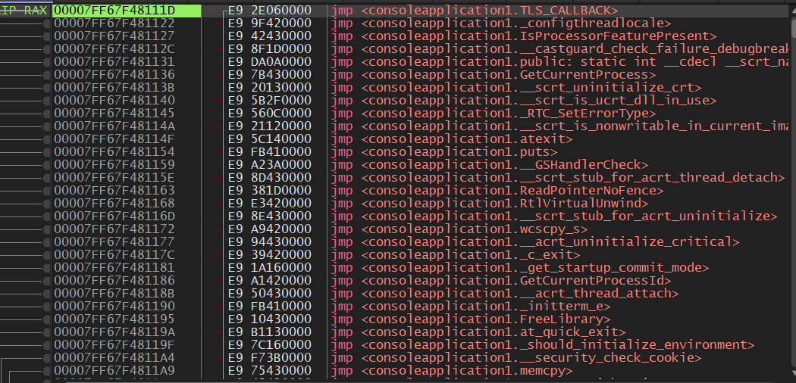
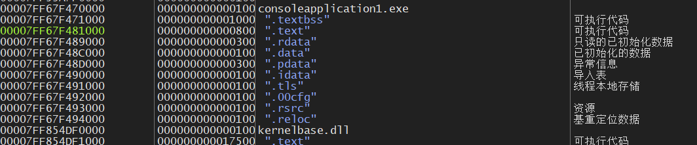
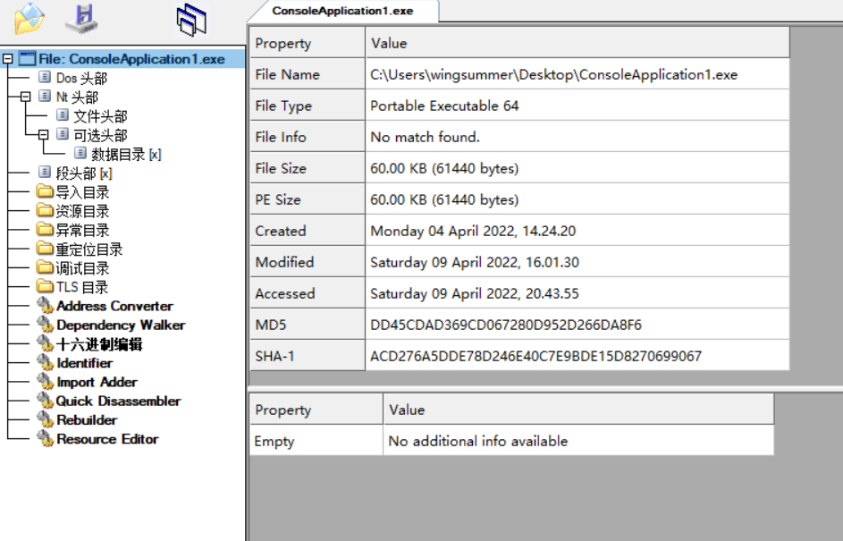
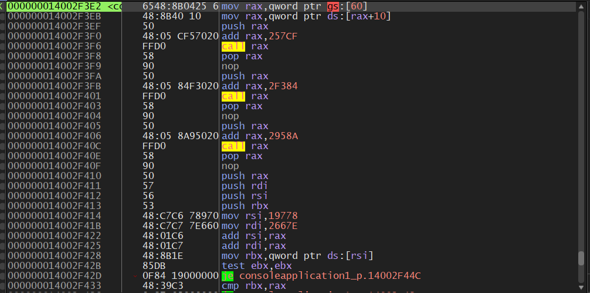
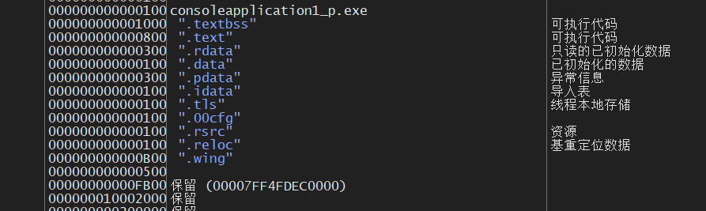
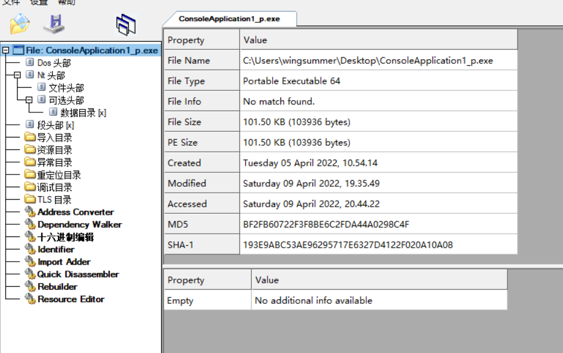

# WingProtecter

&emsp;&emsp;WingProtecter is a packer for PE files on Windows platform.It cost me about one week to write all these nearly 2500 lines of code.The Assembly Engine of this project is asmjit , which is a Amazing and Fantastic toolkit for generating assembly code, of course it has more powerful functions.Please keep these statements  and declarations.Thanks!

&emsp;&emsp;`羽云保护`是在`Windows`平台上的一个加壳程序。该项目的代码编写用了我将近一个周的时间来写差不多2500行代码，使用的汇编引擎是 asmjit ，它是一个能够生成汇编代码的强大而惊人的工具，当然它还有更多的功能。请保留这些声明，万分感谢。

&emsp;&emsp;You can not use it for any commerical use,except you get my AUTHORIZED FORM ME！This project is used for tutorial to teach the beginners what is the PE structure and how the packer of the PE files works.

&emsp;&emsp;你不能将该项目用于任何商业用途，除非你获得了我的授权！该项目用来教初学者什么是 PE 结构和 PE 文件加壳程序是如何工作的。

&emsp;&emsp;WingProtecter supports xor encryption,compression encryption,TLS encryption,IAT encryption,int3 antidebug and junk code for both x86 and x64.

&emsp;&emsp;`羽云保护`支持对于32位程序和64位程序的异或加密、压缩加密、TLS加密、IAT加密、软件断点反调试和花指令。

&emsp;&emsp;The implement of this packer can not be fully introduced.If interested in it,you can find it from [my cnblog](https://www.cnblogs.com/wingsummer/) for this series called "WingSummer Packer World".

&emsp;&emsp;此加壳的实现不能够在本说明寥寥几句就能介绍完的。如果你对此感兴趣，可以从[我的博客园](https://www.cnblogs.com/wingsummer/)找到`羽夏壳世界`系列教程。

&emsp;&emsp;The following pics show the effect of this packer with all the features:

&emsp;&emsp;如下图片展示此加壳软件的全部效果：

&emsp;&emsp;The Original File :

&emsp;&emsp;初始原文件：

&emsp;&emsp;The Packed File :

&emsp;&emsp;被加壳的文件：

&emsp;&emsp;No issues for this project,please note that!

&emsp;&emsp;请注意本项目不接受任何`issue`。
